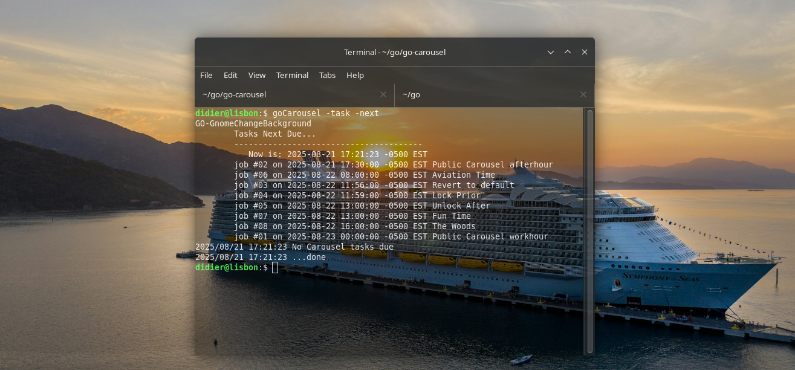
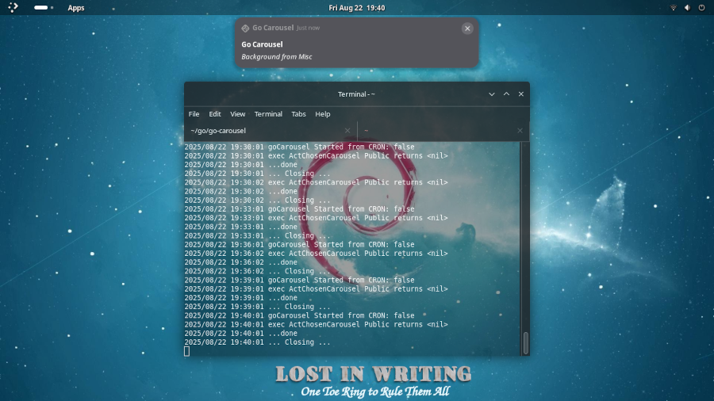

# Go Carousel

A desktop wallpaper carousel for the Linux desktop. Schedule your favorite 
wallpapers with ease and work with enjoyment (almost) regardless of your
desktop manager.

[](https://github.com/lordofscripts/go-carousel/releases)
[](https://goreportcard.com/report/github.com/lordofscripts/go-carousel)
[](https://codecov.io/gh/lordofscripts/go-carousel)
[](https://github.com/sponsors/lordofscripts)
[](https://twitter.com/intent/tweet?text=Scheduled+Desktop+Wallpaper+Carousel&url=https://github.com/lordofscripts/go-carousel&hashtags=go,golang)

<p align="center" width="100%">
    
</p>

**Go Carousel*  is a free application to make your Linux desktop more enjoyable. However,
neither this nor derivative works can be used for [commercial purposes](./LICENSE.md).

If you are like me, you spend a lot of time working at the computer. A single desktop
wallpaper is boring. This makes it fun by letting you define categories, and carousels
of categories. With a simple command-line interface (CLI) you can change it to your
hearts contempt (almost) regardless of the Linux window manager you use.

Supported Window Managers:

- Gnome (43..48)
- Cinnamon
- XFCE v4
- LXDE

You can automate it further by:

* Defining a series of CRON jobs that would change your wallpaper accordingly
* Run it as a task

### History

 Back in 2024 I wrote a shell script to switch the desktop wallpaper on my *Raspberry Pi 2* running the LXDE desktop manager.
 I could do it via the CLI or via a desktop shortcut.

 I moved to my old laptop where I used Debian 12 (Bookworm). Around
 May 2024 I wrote a rudimentary Bash shell script to do the same
 I could do on my Pi. Little by little I added more features like
 a rudimentary authorization, locking, categories and notifications
 using `notify-send`.

 On August 2025 I upgraded my old laptop to **Debian 13* (Trixie)
 to take advantage of Gnome 48. I decided to overhaul my old
 Bash shell script into a full-blown *Go* application. I prefer
 compiled languages to scripts and interpreted languages.

 And so, the tool is now written in pure Go (v1.24.1 or better). I
 changed the old configuration file for a JSON file that would
 allow me to add the extra features the Go version now sports.

|     | Show your support   |
| --- | :---: | 
| [ ](https://allmylinks.com/lordofscripts)      | visit <br> Lord of Scripts&trade; <br> on [AllMyLinks.com](https://allmylinks.com/lordofscripts)                  |
| [ ](https://allmylinks.com/lordofscripts)|  buy Lord of Scripts&trade; <br> a Capuccino on <br>[BuyMeACoffee.com](https://www.buymeacoffee.com/lostinwriting)| 

## Features

* A simple CLI interface
* A single, portable JSON configuration file (`~/.config/coralys/goCarousel.json`)
* Supports multiple window managers: Gnome, Cinnamon, LXDE, XFCE.
* Desktop notifications (ensure your server is properly configured)
* The notion of files (wallpaper), categories and carousels (collection of categories)
* You can select a specific wallpaper file
* You can let it pick a random wallpaper from a selected category
* You can let it pick a random wallpaper from a random category from a chosen carousel
* You can have *private categories* that are autorized by the presence of a H/W key
* Can run as an *angel* (not quite a *daemon*) so that it uses
the built-in scheduler instead of depending on CRON.
* Notifications are now more universal (DBus, LibNotify, etc.)

<p align="center" width="33%">
    
    
    
</p>

*Become a Diamond sponsor and get your logo & link listed here 3-5 slots*

### Proposed Wallpaper structure

Most desktops nowadays have a directory called `Pictures` and all Linux desktops seem
to have adopted that Windows thing as well. I put all my desktop wallpapers in a
subdirectory `Pictures/Wallpapers` or at least general wallpapers.

Then under that directory I create multiple directories, one for each category. For
example:

```
    · ~/Pictures
        · Wallpapers
            · Aviation
            · Nature                        
            · Anime
            · Writing
            · Misc
            · Personal
```

So, you see this setup has several categories: `Aviation, Anime, Misc, Nature, Writing`
and `Personal`. That's how I classify my wallpapers, by category so that its is easy
to pick them depending on the mood or time of day. In each category you can put a
small (hidden) icon file `.category_icon.png` of size 100x100 which is used by the
Notification system when a wallpaper from that category is chosen.

For the sake of an example, I have a `Personal` category that is protected by a hardware
key. If that category is in a carousel and it picks a file from there, it will only be
set as wallpaper if the *authorization* is successful (I use a simple scheme just for fun).

## Installation

**Go Carousel** is written in pure **GO** (v1.24.3).

```
    go install github.com/lordofscripts/go-carousel@latest
```

## Usage

Note that you need a valid configuration file for this application to do
its job. *It is not sufficient to have the directory structure in place*.

`goCarousel --help` gets you all you need to know to make advantage of it.

`goCarousel -init` creates a default configuration file. You must edit it to

`goCarousel -ident` tells you which Desktop Manager it has detected. If it is
one of the supported managers, you are good to go, else expect errors.

### Control options

`goCarousel -lock` locks the application so that further calls do NOT change
the current wallpaper. This is good if you want to ensure scheduler entries
do not change the wallpaper in blackout periods.

`goCarousel -unlock` reverts what `-lock` does. After this `goCarousel` will
be able to change wallpapers again.

`goCarousel -status` gives the the current lock status.

### Change Wallpaper

The following commands should be successful provided there is no *Lock*.

`goCarousel -F PATH-TO-FILE` changes the wallpaper to the specifc file.
NOTE that if it is in a protected category, it will by-pass authorization
because it assumes that is what you wish.

`goCarousel -C CATEGORY` picks a random file from the selected *Category* 
provided that category is **defined** in the configuration file. A category
may have an icon for use in notifications. By default categories are **not**
protected (do not require authorization). If you want the category to be
protected (like the `Personal` category above), you must specify that in
the configuration file.

`goCarousel -G GROUP` selects that *Group/Carousel* and selects a random
category from that group. A group contains one or more Categories, all of
them defined in the configuration file. Then from the selected category,
it picks a random wallpaper. You can define multiple Carousels therein.

`goCarousel -any` picks a random wallpaper from the general directory
defined in the configuration file.

`goCarousel -default` reverts to the default wallpaper defined in the
configuration file. In my window manager (X11 or Wayland) I defined a
shortcut so that when I press the `Pause` key on my keyboard, it invokes
this command.

### Scheduler options

The application has its own scheduler.

`goCarousel -verify` goes through the scheduler entries in the configuraition
file and tells you which ones are correct. It checks they fulfill the
standard CRON job notation.

`goCarousel -task` examines the schedules defined in the configuration file,
and checks if any of those are due (just like CRON does). If anything is
due, it performs the desired action:

```
    {
      "title": "Fun Time",
      "action": "ActChosenCarousel",
      "argument": "Private",
      "cron_tab": "*/10 13-14 * * 1-5"
    },
```

This Scheduled task is named `Fun Time` and is considered due every
10 minutes between 13-14 hours (1 PM to 2 PM) from Monday through
Friday. When due it sets the wallpaper (*conditioned by the authorization*)
to one from the `Private` **carousel**.



Together with `-task` you can use the `-next` option which will enumerate
each of the registered tasks and when would be the next time they would run.

The following are valid **Task** actions. All tasks need a Task schedule (CRON
notation):

* `ActChosenCarousel` (carousel name as argument) Pick from *Carousel*
* `ActDefaultWallpaper` (no argument) Pick default wallpaper
* `ActLockCarousel` (no argument) *Locks* carousel
* `ActUnlockCarousel` (no argument) *Unocks* carousel
* `ActChosenCategory` (category name as argument) Pick from chosen *Category*
* `ActChosenFile` (wallpaper file as argument) Pick that specific wallpaper.

`goCarousel -daemon MINUTES` A great option to run the carousel if you just want to 
let it do its thing without needing user CRON entries. Provided you have
entered scheduling information in the `schedules` section of the JSON 
configuration file, the application will run in daemon mode.

While in daemon mode, it will not return until the specified amount of 
*Minutes*  have elapsed. During that time, it will perform any task from
the `schedules` section as they become due. Note that the configuration
file has options for the daemon in the `angel` section. There you can
specify the Actions that will be done upon entering and exit that mode.

## Configuration

The configuration file is formatted as JSON in the `~/.config/coralys/goCarousel.json`
file.

If you read this document properly, you should know you can generate a sample
version similar to [this](./goCarousel_sample.json).

### CRON Scheduling

If you will be running `goCarousel` from as a CRON job, then a bunch of information
will not be available to the process. The application will have to dig the information
by querying processes (not yet implemented). As a last resort, it will use the 
`assume_session` option in the `options` section of the configuration file. This
value must be one of: `gnome, xfce4, lxde, cinnamon`.

### Desktop Notifications



If you want desktop notifications every time the wallpaper is changed, then enable
them  by setting `notify` to `true` in the `options` section of the configuration
file. Please ensure that your system has a properly setup notifications system.

### Protected Categories

```
    "Anime": {
      "protected": true,
      "key_name": "MMC_Card",
      "directory": "/home/lordofscripts/Pictures/Wallpapers/Anime"
    }
```

Protected **Categories** are used when you have wallpapers that may not look
very professional in your environment. For example Anime on the workplace, etc.
For that, you set the `protected` attribute to `true` in the corresponding
category and you must also set the `key_name` attribute of that same category.
The value of the key name must be one of those listed as JSON *key* in the
`key_devices` section of the configuration file.

```
  "key_devices": {
    "MMC_Card": "058f:6335 E0FD-1813 5844bef71c16299cc5d73334153544be",
    "USB-Maxell": "058f:6387 MAXELL_RED 5844bef71c16299cc5d73334153544be"
  }
```

The matching key has a value with three fields separated by a *space*.
The 1st is a `vendorId:productId` pair, every USB or MMC card has it.
The 2nd is the device's *volume label* and the 3rd is an MD5 sum/hash
of a file named `goCarousel.png` found on the root directory of that
device. For that `goCarousel` must find the mounting point. But in
general this simple scheme works well and does not need to be cryptographically
secure.

## Sponsors

*Become a sponsor and get your name listed here!*